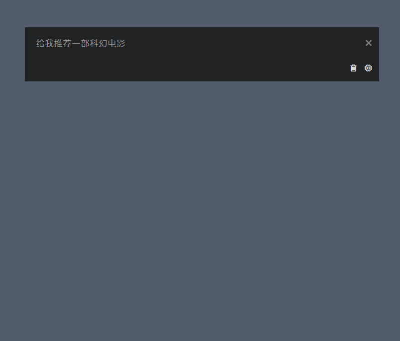

# LLMChatWindow (AI 悬浮聊天窗)

一个使用 WPF 和 C# 构建的简洁 AI 聊天悬浮窗应用程序。

## 功能特性

*   用于与大语言模型 (LLM) 交互的聊天界面。
*   加载和保存聊天记录。
*   可通过设置窗口配置 API 参数 (API Key, Base URL, 模型名称)。
*   程序主要运行在系统托盘区域。
*   支持全局快捷键 (`Alt + Space`) 显示/隐藏窗口。
*   尝试根据 Windows 系统的浅色/深色主题自动切换托盘图标颜色。

## 安装指南

1.  **下载**: 前往本项目的 [GitHub Releases 页面](https://github.com/luoluoluo22/LLMChatWindow/releases)。找到最新的版本，下载名为 `LLMChatWindow_Installer_vX.X.X.X.zip` (或类似名称) 的压缩包文件。
2.  **解压**: 将下载的 `.zip` 压缩包解压到一个本地文件夹。
3.  **安装**: 进入解压后的文件夹，找到并运行 `setup.exe` 文件。按照屏幕提示完成安装。
    *   **注意**: 安装程序可能会提示您安装所需的 **.NET Desktop Runtime** (如果您的系统尚未安装)。请允许安装。

## 使用方法

1.  **启动**: 安装完成后，可以从 Windows **开始菜单** 找到并启动 `LLMChatWindow`。程序启动后会在系统托盘（屏幕右下角通知区域）显示一个图标。
2.  **显示/隐藏窗口**: 
    *   使用**全局快捷键 `Alt + Space`** 可以快速显示或隐藏聊天窗口。
    *   **左键单击**系统托盘图标也可以显示/隐藏窗口。
    *   **右键单击**系统托盘图标，选择"显示/隐藏窗口"。
3.  **配置 API**: 
    *   首次运行时，您需要配置连接 AI 服务所需的 API 参数。
    *   点击聊天窗口上方消息列表区域右侧的**齿轮图标 (⚙️)** 打开设置窗口。
    *   在设置窗口中填入您的 **API Key**、服务的 **Base URL** 以及要使用的 **Model Name**。
    *   点击"保存"。
    *   如果您没有有效的 API Key 或配置不正确，将无法与 AI 进行交互。
4.  **聊天**: 
    *   在窗口顶部的输入框中输入您的问题或指令。
    *   按 `Enter` 键发送。
    *   等待 AI 回复显示在下方。
5.  **清除记录**: 点击聊天窗口上方消息列表区域右侧的**垃圾桶图标 (🗑️)** 可以清除当前的所有聊天记录。
6.  **退出程序**: **右键单击**系统托盘图标，选择"退出"。

## 数据存储

*   **设置 (`settings.json`)** 和 **聊天记录 (`chathistory.json`)** 文件会自动保存在当前用户的应用程序数据目录中: `%APPDATA%\LLMChatWindow\` (通常是 `C:\Users\<你的用户名>\AppData\Roaming\LLMChatWindow\`).

## 构建 (开发者)

1.  克隆本仓库。
2.  使用 Visual Studio 打开解决方案 (`LLMChatWindow.sln`)。
3.  确保已安装所需的 .NET Desktop Runtime (本项目目标框架为 .NET 9)。
4.  还原 NuGet 包。
5.  生成解决方案 (Debug 或 Release 配置)。 